# Personal Portfolio & Blog

개인 포트폴리오 & 블로그

A modern, responsive personal website built with **Next.js**, **TypeScript**, and **Tailwind CSS**.  
This project was mainly built for my own use — to introduce myself, share my projects and thoughts —  
but you’re welcome to explore or reference it if you find it helpful.

**Next.js**, **TypeScript**, **Tailwind CSS**로 제작한 반응형 개인 웹사이트입니다.  
저를 소개하고, 프로젝트와 블로그, 추천서 및 연락처 정보를 한 곳에 담은 개인 사이트입니다.  
개인 필요에 맞춰 만들었지만, 참고하거나 사용해도 괜찮습니다.

## Tech Stack / 기술 스택

- **Framework / 프레임워크:** [Next.js](https://nextjs.org)
- **Language / 언어:** [TypeScript](https://www.typescriptlang.org/)
- **Styling / 스타일링:** [Tailwind CSS](https://tailwindcss.com)
- **Markdown Engine:** [MDX](https://mdxjs.com/)
- **Deployment / 배포:** [Vercel](https://vercel.com)

## Dynamic Theme / 시간대별 테마

The site theme changes depending on the visitor’s local time —  
Morning / Day / Evening / Night — creating a dynamic and immersive mood.  
사용자의 접속 시간에 따라 테마가 자동으로 바뀝니다.  
아침, 낮, 저녁, 밤 네 가지 테마로 각각 다른 분위기를 제공합니다.

|                     Morning                      |                   Day                    |                     Evening                      |                    Night                     |
| :----------------------------------------------: | :--------------------------------------: | :----------------------------------------------: | :------------------------------------------: |
| 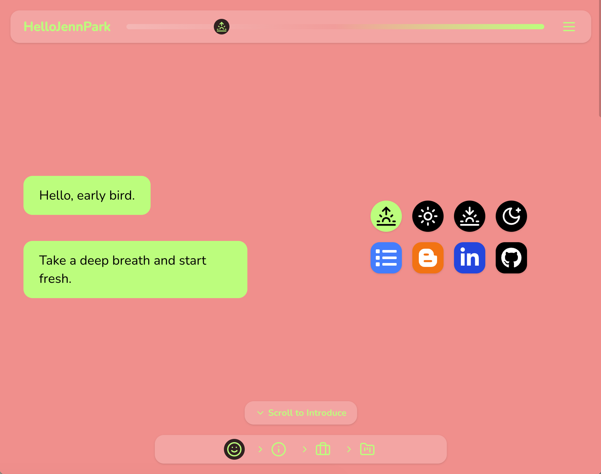 | 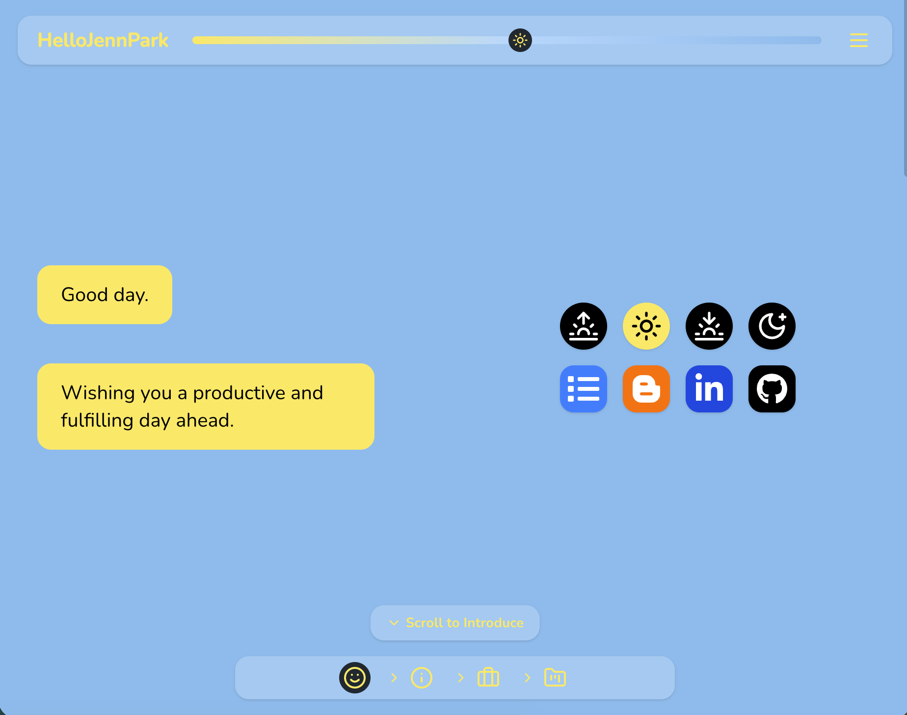 | 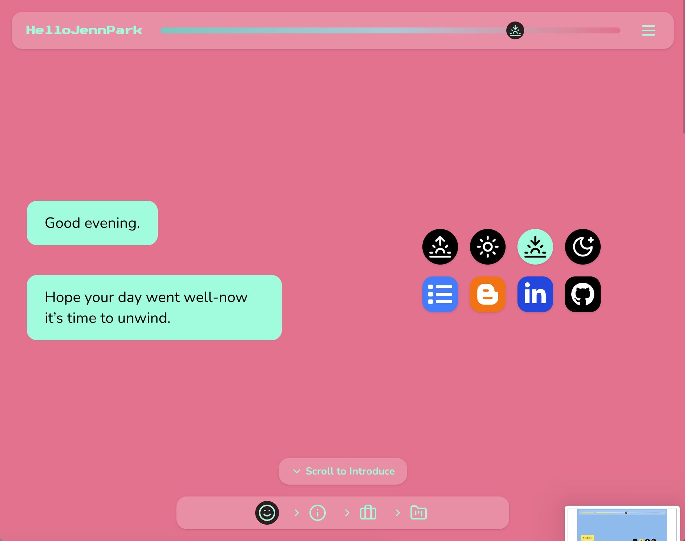 | 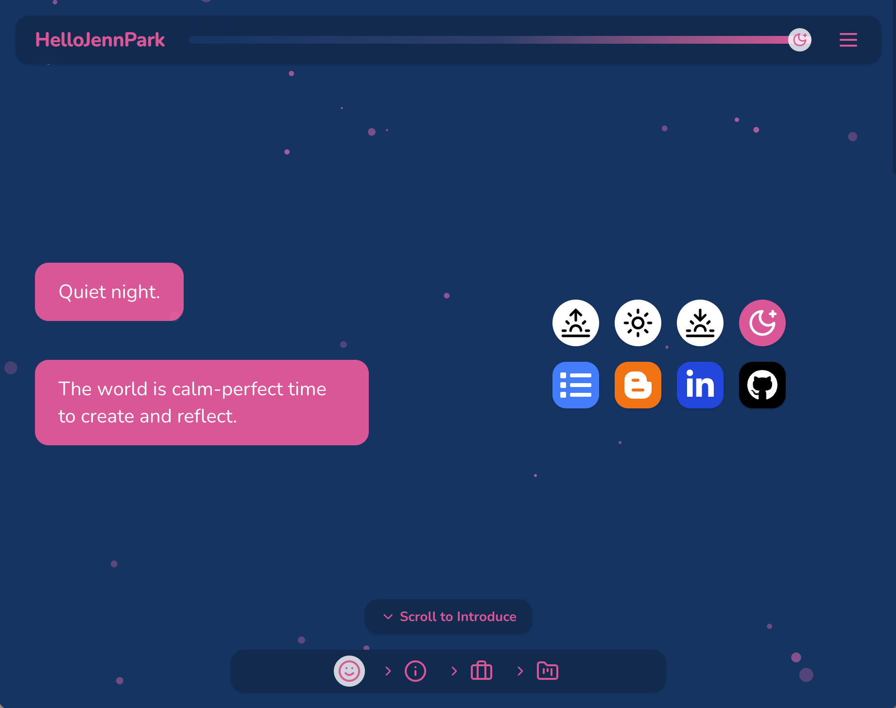 |

## Responsive Layout / 반응형 레이아웃

Optimized for both desktop and mobile devices.  
모든 화면 크기에서 최적화된 반응형 레이아웃을 제공합니다.

|                    Desktop                     |                  Mobile                   |
| :--------------------------------------------: | :---------------------------------------: |
|  | 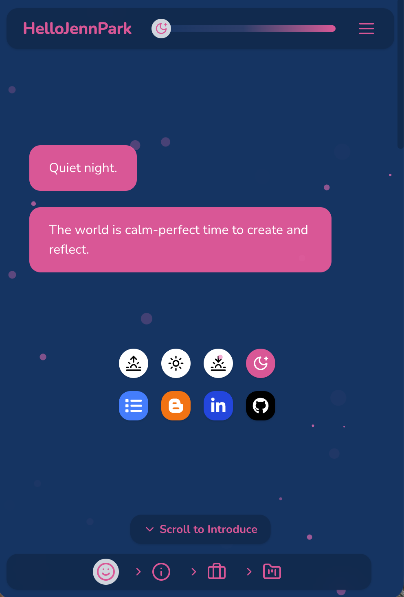 |

## Main Page Overview / 메인 페이지 구성

The main page scrolls through the following sections:

**Hero → Introduce → Career → Blog**

메인 페이지는 위 순서로 구성되어 있으며,  
스크롤로 자연스럽게 이어집니다.

| Section / 섹션 |                  Preview / 미리보기                  |
| :------------- | :--------------------------------------------------: |
| **Hero**       |             |
| **Introduce**  |  |
| **Career**     |      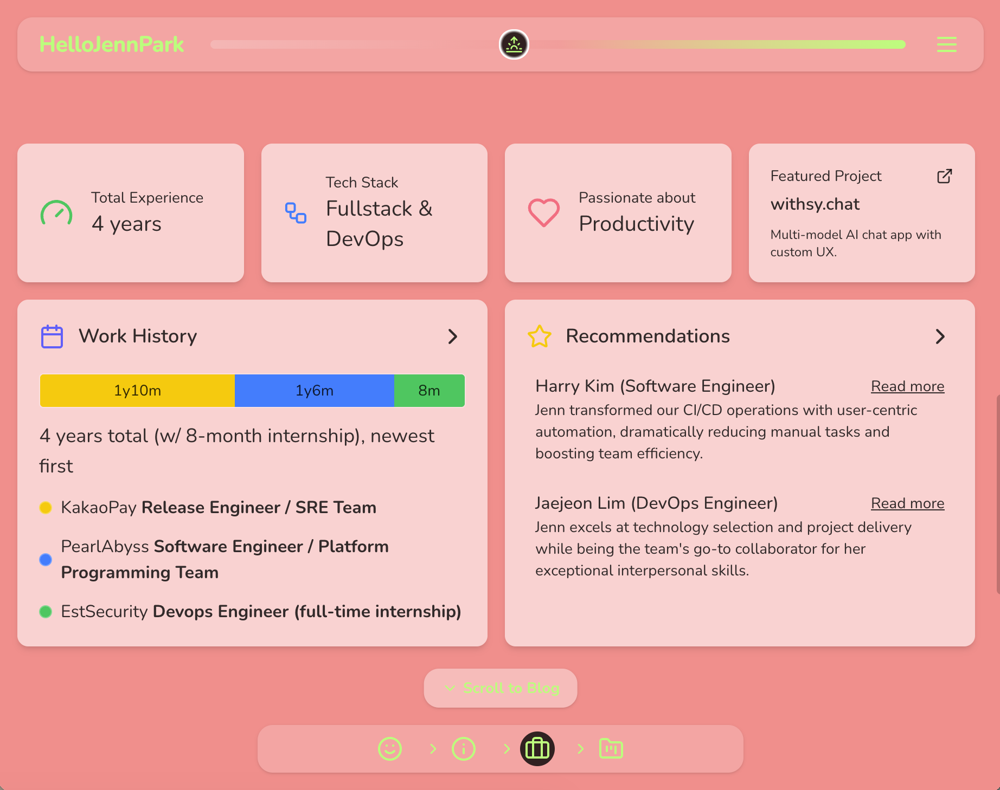       |
| **Blog**       |        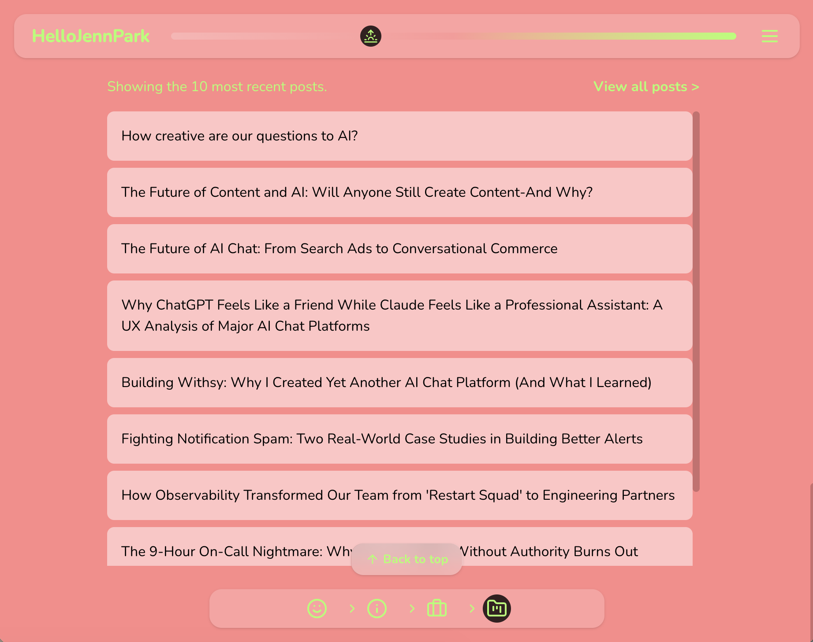         |

### **Features / 주요 특징**

- The **header** includes a **time slider** to manually change the theme.  
  헤더에서는 **시간대 슬라이더**를 통해 사용자가 직접 테마를 조정할 수 있습니다.
- The **footer** shows your current section and allows quick navigation.  
  푸터에서는 현재 위치한 섹션을 표시하고, 클릭 시 해당 섹션으로 바로 이동할 수 있습니다.
- A **semi-transparent navigation bar** and smooth scroll buttons enhance UX.  
  반투명 네비게이션 바와 스크롤 버튼으로 자연스러운 이동이 가능합니다.
- At the bottom, users can scroll back to the top with one click.  
  마지막 섹션에서는 한 번의 클릭으로 최상단으로 이동할 수 있습니다.

## Categories / 카테고리

|                     Desktop                     |                    Mobile                     |
| :---------------------------------------------: | :-------------------------------------------: |
| 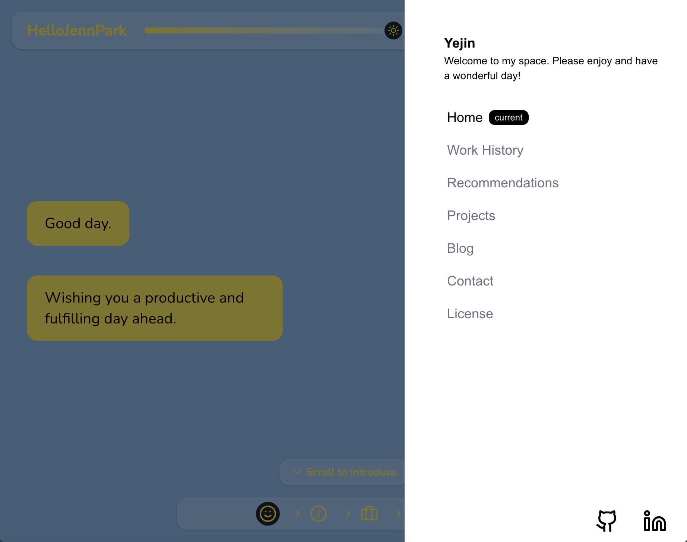 | 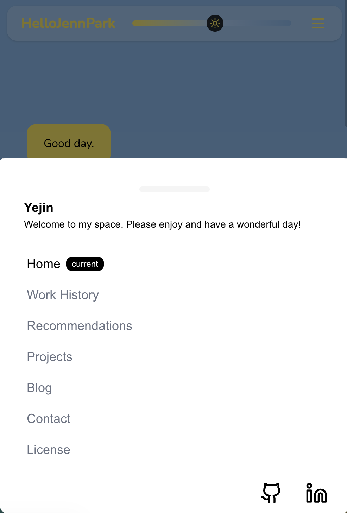 |

- **Home**
- **Work History**
- **Recommendations**
- **Blog**
- **Contact**
- **License**

The bottom-right corner includes links to **GitHub** and **LinkedIn**.  
우측 하단에는 **GitHub**과 **LinkedIn**으로 이동하는 버튼이 있습니다.

## Blog Features / 블로그 기능

|         Blog Main / 메인         |           Tags / 태그            |          Post / 포스트           |
| :------------------------------: | :------------------------------: | :------------------------------: |
| 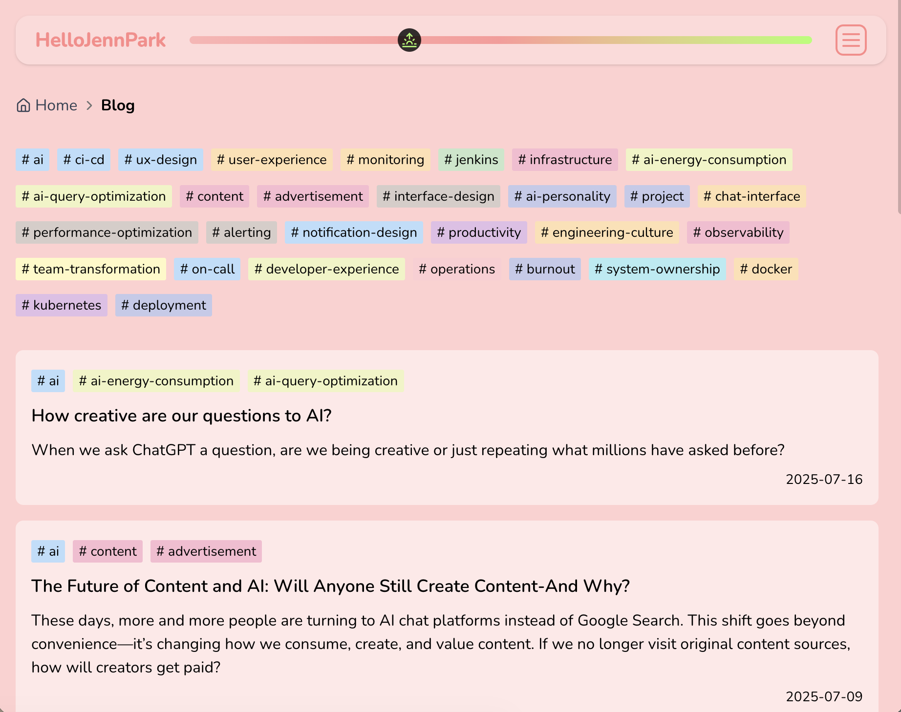 | 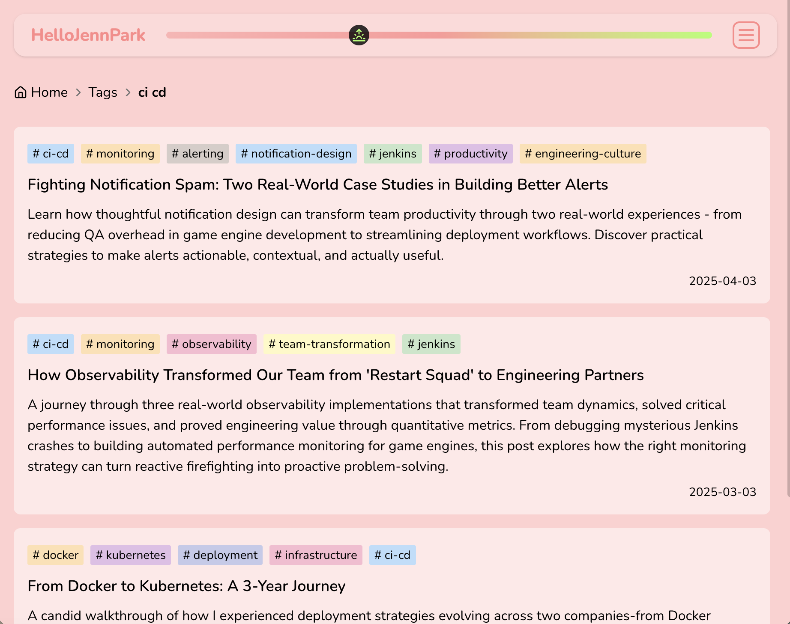 | 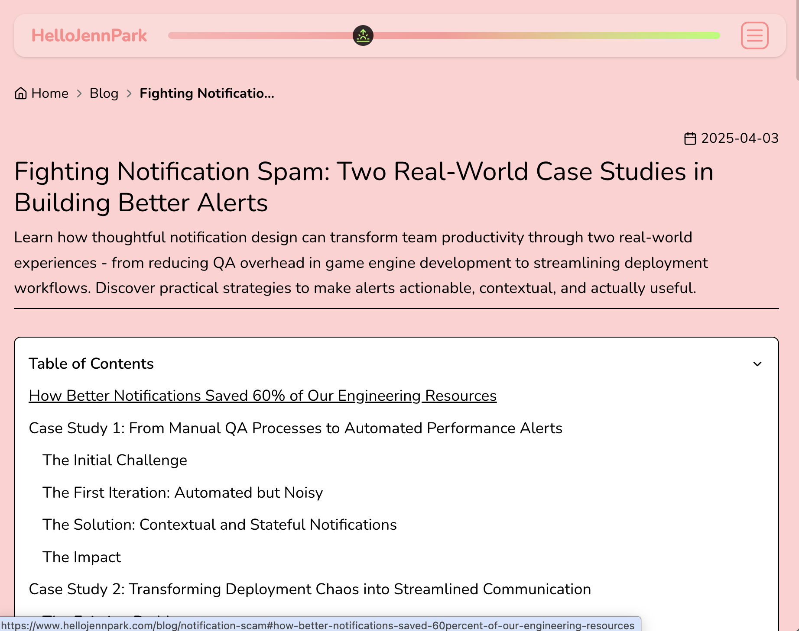 |

- Blog posts are written in **MDX**.  
  블로그 포스트는 **MDX**로 작성할 수 있습니다.
- A **Table of Contents (ToC)** is generated automatically for each post.  
  각 포스트마다 **목차(ToC)**가 생성됩니다.
- Supports **Tag filtering** to browse posts by topic.  
  **태그 필터링**을 통해 주제별로 글을 탐색할 수 있습니다.
- Popular tags are shown first.  
  많이 사용된 태그가 상단에 노출됩니다.
- Clicking a ToC heading scrolls directly to that section.  
  목차의 소제목을 클릭하면 해당 위치로 바로 이동합니다.

## Deployment / 배포

Deployed via **Vercel**.  
배포는 **Vercel**을 통해 진행되었습니다.

🔗 **Personal Website:** [https://hellojennpark.com/](https://hellojennpark.com/)

## Note / 참고

This project was built mainly for personal use,  
but you’re free to explore or adapt parts of it for your own needs.  
이 프로젝트는 개인적인 목적에 맞게 개발되었지만,  
원한다면 자유롭게 참고하거나 일부를 응용해도 괜찮습니다.

### Thanks for Visiting

방문해 주셔서 감사합니다!
